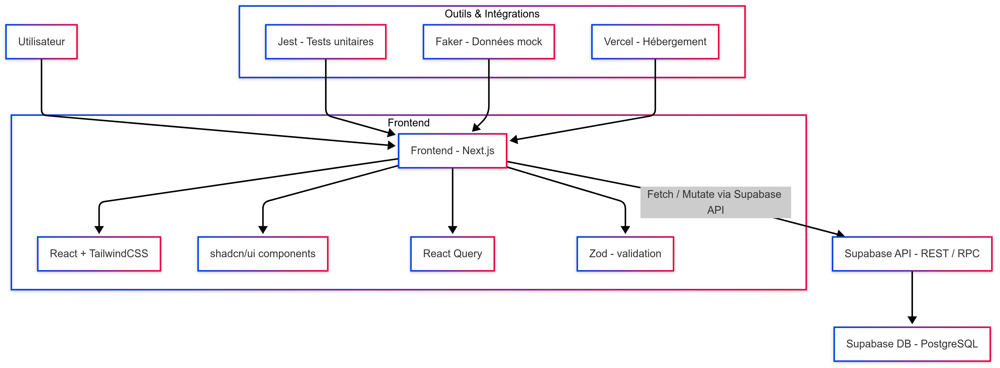

<!-- Ollert logo -->

<p align="center">

</p>

# Ollert - Gestion de Projets Collaboratifs

Ollert est une application de gestion de projets inspirée de Trello. Elle permet aux utilisateurs de créer des tableaux, d'ajouter des colonnes, de gérer des tickets et de collaborer avec d'autres utilisateurs en temps réel.

<br>
<br>

## Fonctionnalités

- **Tableaux** : Créez et gérez plusieurs tableaux pour organiser vos projets.
- **Colonnes** : Ajoutez, modifiez ou supprimez des colonnes dans vos tableaux.
- **Tickets** : Déplacez des tickets entre les colonnes grâce au glisser-déposer.
- **Collaborateurs** : Invitez des utilisateurs à collaborer sur vos tableaux.
- **Interface intuitive** : Une interface simple et élégante pour une gestion efficace.


<br>
<br>

## Mermaid

<p align="center">
    
</p>


<br>
<br>

## Installation

### Prérequis

- [Node.js](https://nodejs.org/) (version 16 ou supérieure)
- [npm](https://www.npmjs.com/) ou [yarn](https://yarnpkg.com/)

### Étapes

1. Clonez le dépôt :

   ```bash
   git clone https://github.com/votre-utilisateur/ollert.git
   cd ollert
   ```
2. Installez les dépendances :

    `npm install`
    ou
    `yarn install`

3. Configurez les variables d'environnement :

    Créez un fichier .env.local à la racine du projet et ajoutez les variables nécessaires, par exemple :
    ```env
    NEXT_PUBLIC_SUPABASE_URL=your-supabase-url
    NEXT_PUBLIC_SUPABASE_ANON_KEY=your-supabase-anon-key
    ```

4. Lancez l'application en mode développement :

    `npm run dev`
    ou
    `yarn dev`

5. Ouvrez votre navigateur et accédez à `http://localhost:3000`.

<br>
<br>

## Utilisation

1. Tableau de bord

* Une fois connecté, vous accédez à votre tableau de bord où vous pouvez voir tous vos tableaux.
* Cliquez sur "Créer un tableau" pour ajouter un nouveau tableau.

2. Gestion des colonnes

* Dans un tableau, ajoutez des colonnes en cliquant sur "Ajouter une colonne".
* Modifiez ou supprimez une colonne en utilisant le menu d'actions (icône "..." sur chaque colonne).

3. Gestion des tickets

* Ajoutez des tickets dans une colonne.
* Déplacez les tickets entre les colonnes grâce au glisser-déposer.

4. Collaborateurs

* Invitez des collaborateurs à votre tableau en cliquant sur "Ajouter un collaborateur".
* Les collaborateurs peuvent voir et interagir avec les colonnes et les tickets.


### Scripts disponibles

* `npm run dev` : Lance l'application en mode développement.
* `npm run build` : Compile l'application pour la production.
* `npm run start` : Démarre l'application en mode production.
* `npm run lint` : Analyse le code pour détecter les erreurs et les problèmes de style.`


### Technologies utilisées

* Framework : [Next.js 15 (App Router)](https://nextjs.org)
* Base de données : MySQL (via [Supabase](https://supabase.com/))
* Backend-as-a-Service : [Supabase](https://supabase.com)
* Drag & Drop : [Dnd-kit](https://dndkit.com/)
* UI Components : [TailwindCSS](https://tailwindcss.com/) et [Shadcn/ui](https://ui.shadcn.com/)
* Icônes : [Lucide React](https://lucide.dev/)
* Typage des données : [Zod](https://zod.dev/)
* Tests : [Jest](https://jestjs.io/fr/)
* CI/CD : GitHub Actions

<br>
<br>

## Contribution
Les contributions sont les bienvenues ! Si vous souhaitez contribuer :

1. Forkez le projet.
2. Créez une branche pour votre fonctionnalité (`git checkout -b feature/ma-fonctionnalite`).
3. Commitez vos modifications (`git commit -m 'Ajout de ma fonctionnalité'`).
4. Poussez votre branche (`git push origin feature/ma-fonctionnalite`).
5. Ouvrez une Pull Request.


<br>
<br>

## Licence
Ce projet est sous licence MIT.


<br>
<br>

## Auteurs
Si vous avez des questions ou des suggestions, n'hésitez pas à nous contacter !<br>
Développé par: 

* <b>[Florian PALVADEAU](https://github.com/FlorianPALVADEAU)</b>
* <b>[Adel KHITER](https://github.com/adelktr)</b>
* <b>[Elyes VOISIN](https://github.com/elyesv)</b>
* <b>[Louis PERRENOT](https://github.com/louisperre)</b>


### Points importants :
1. **Installation** : Explique comment configurer et démarrer l'application.
2. **Utilisation** : Décrit les principales fonctionnalités de l'application.
3. **Technologies utilisées** : Liste les outils et bibliothèques utilisés.
4. **Contribution** : Encourage les contributions au projet.
5. **Licence** : Mentionne la licence du projet.

Vous pouvez personnaliser ce fichier en fonction de vos besoins spécifiques.